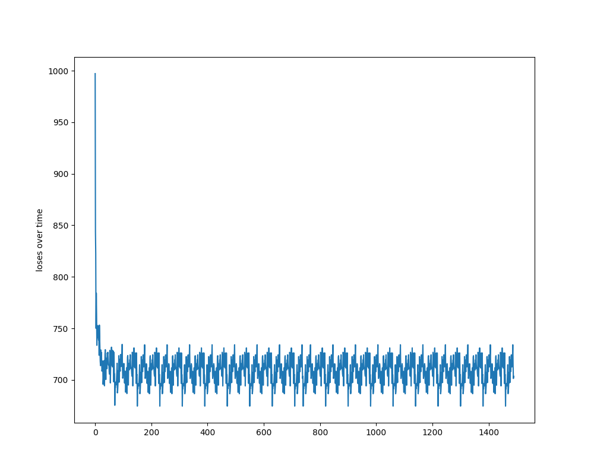

# Linear Support Vector Machines
Suppose some given data points each belong to one of two classes, and the goal is to decide which class a new Data point will be in. In the case of support vector machines, a data point is viewed as a p-dimensional vector, and we want to know whether we can separate such points with a (p-1)-dimensional hyperplane. This is called a linear classifier. There are many hyperplanes that might classify the data. One reasonable choice as the best hyperplane is the one that represents the largest separation, or margin, between the two classes. So we choose the hyperplane so that the distance from it to the nearest data point on each side is maximized.

### Usage

```python
model = NeuralNetoworkclassifier()
model.add_data(data,label,val_data,val_label)  
# data is mxn dimensional np array while label is 1 dimensional np array
model.InitializePars([input_dim,hidden1,hidden2,......,output_dim])
model.set_lr(lr)
model.set_reg(rs)
model.set_bs(bs)
model.GradientDescent(num_epoches)
# Use model.give_prediction(test_data,k) to get prediction for some k
# Use model.give_prediction_and_accuracy(test_data,labels,k) to get dictionary containing both
# prediction_labels and accuracy 
```


### Implementation
It is an inherited class of Generalclassifier. The function InitializePars helps in changing the standard deviations and mean of svm parameters.
It performs gradient descent using rate decay over the svm loss. Decay rate can be manually set up.


### References
* [A nice Video](https://ocw.mit.edu/courses/electrical-engineering-and-computer-science/6-034-artificial-intelligence-fall-2010/lecture-videos/lecture-16-learning-support-vector-machines/)
* [SVM loss function](http://cs231n.github.io/linear-classify/)
* [Wiki](https://en.wikipedia.org/wiki/Support_vector_machine#Linear_SVM)

### Results
Best Validation Accuracy 0.3640 for lr :0.00000500 rs :1000.0000 bs :600.000000 

And Testing Accuracy is 0.3674

### Loss Curves
